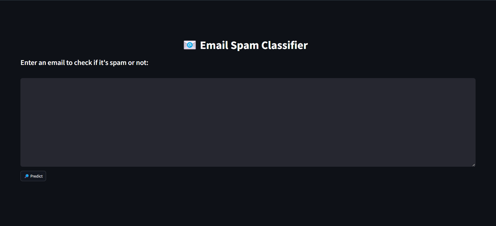

# 📬 Mail Classifier - Intelligent Spam Detection App

Welcome to **Mail Classifier**, a powerful web app that uses Machine Learning to classify emails as **Spam** or **Not Spam**. Whether you're a developer, analyst, or just curious about how spam detection works — this project is a simple, elegant example of applied NLP.

---

## 🚀 Features

- 📩 Classifies raw email/text into **Spam** or **Ham**
- 🤖 Trained with **CountVectorizer** + **Multinomial Naive Bayes**
- 🧠 Pre-trained model saved as `.pkl` files
- 🖥️ Interactive and clean **Streamlit** UI
- ⚡ Fast and easy to use — just paste and classify!

---

## 🛠 Tech Stack

- **Python**
- **Streamlit** – for web UI
- **Scikit-learn** – ML model & vectorization
- **Pandas/Numpy** – Data preprocessing
- **Pickle** – Model persistence

---

## 📸 App Preview

